# COLLEGE LIBRARY SYSTEM

* Purpose: (Object oriented at information management Project) of my client
* Programming Language: Visual Basic.Net
* Target Framework: .Net Framework 4.6.1
* IDE: MS Visual Studio 2012
* Backend Database: MS Access 2013
* Type of Application: Desktop Application (Windows Forms)
* Hashing Function: Bcrypt

<h2> User Interface Screenshots </h2> 
  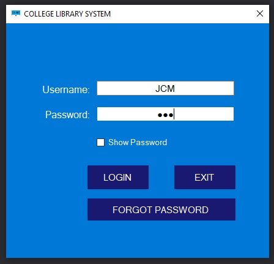
  
  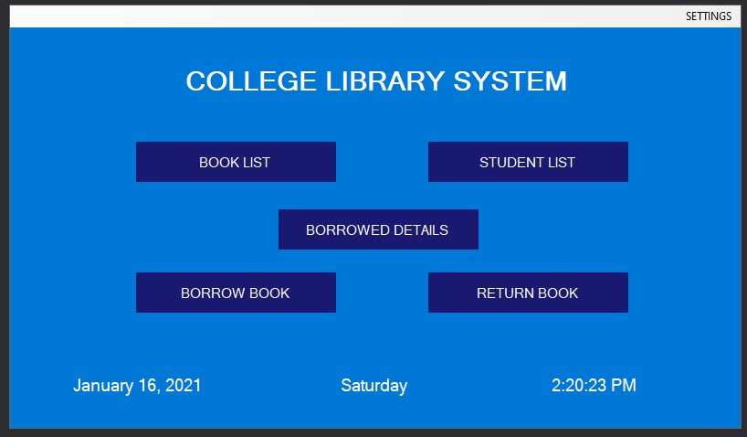
  
  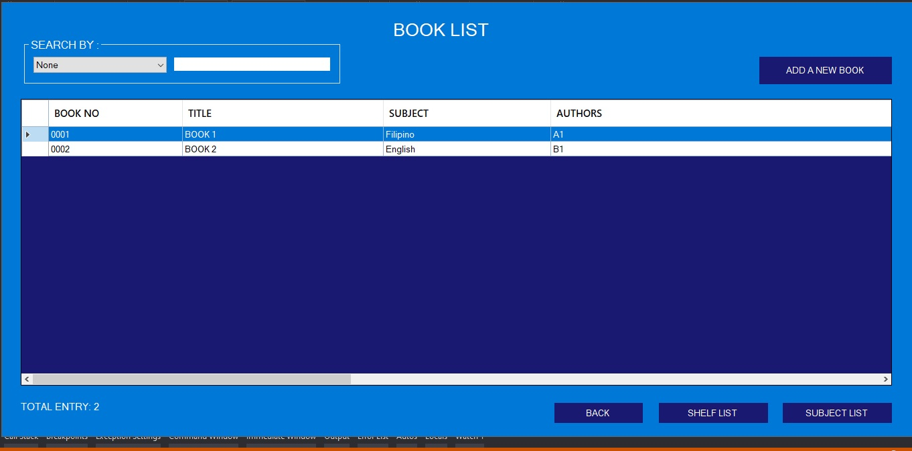
  
  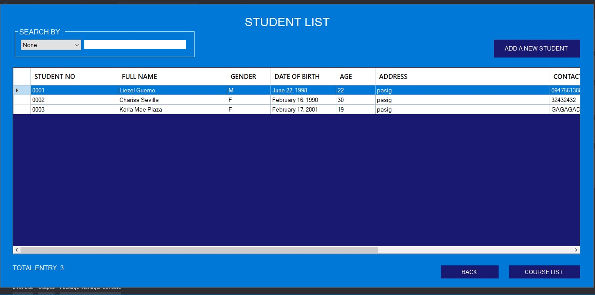
  
  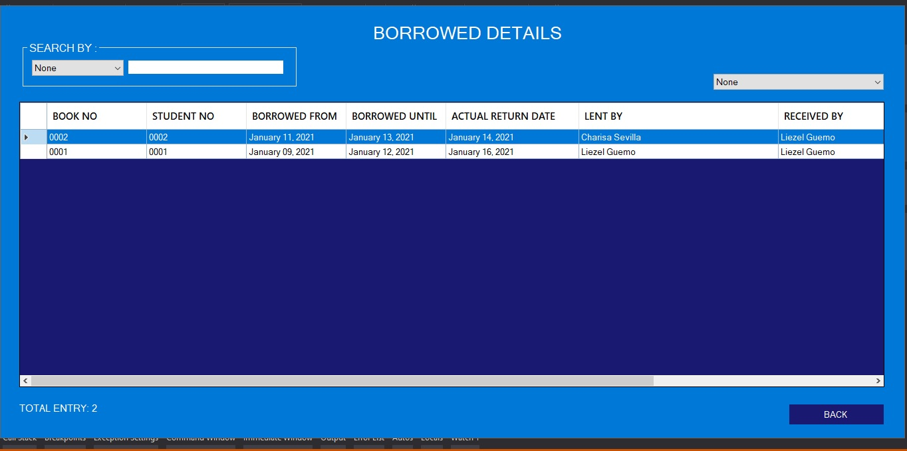
	
  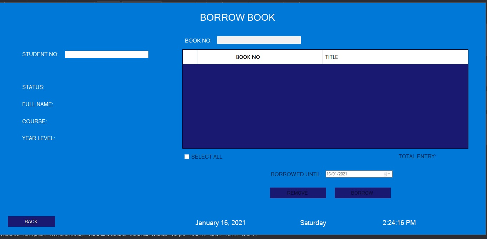
	  
  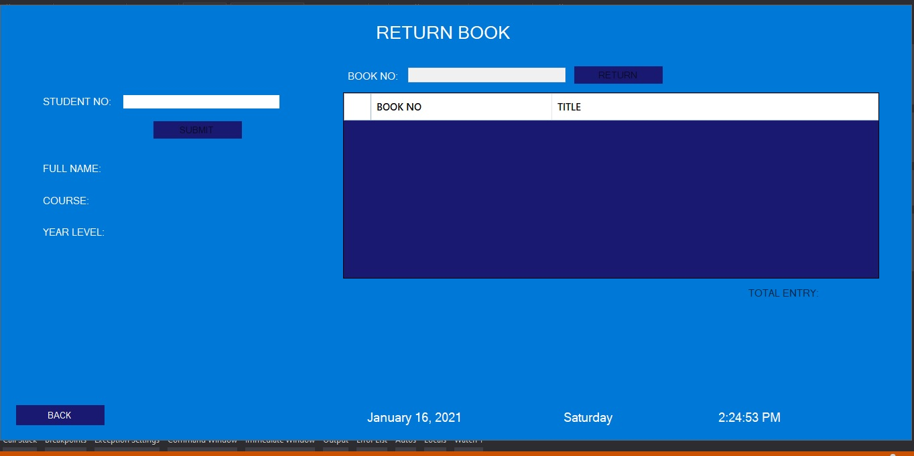
				  
  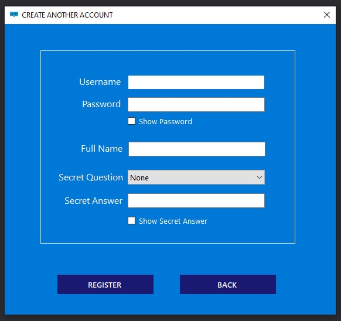
  
  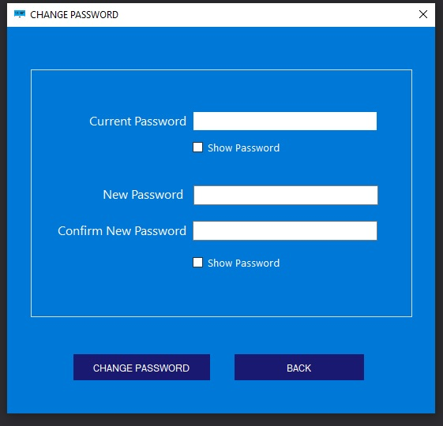

  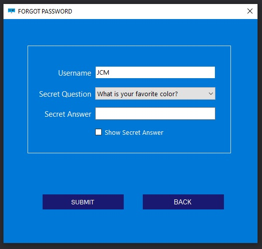
  
<h2> Database Design from the scratch </h2> 
  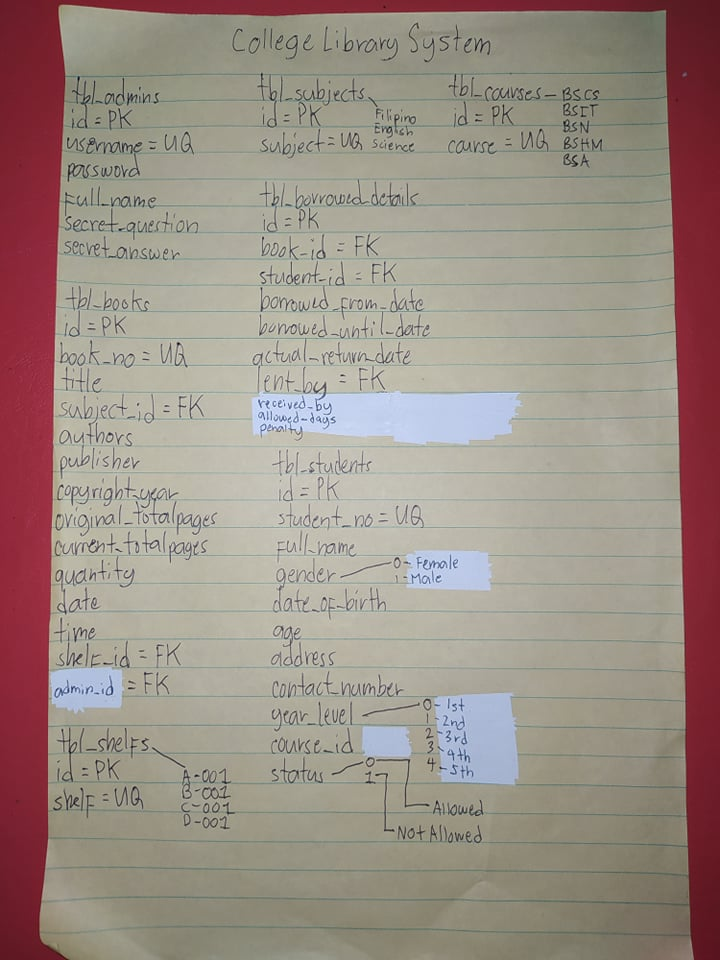
	
<h2> Database Design in MS Access </h2> 
  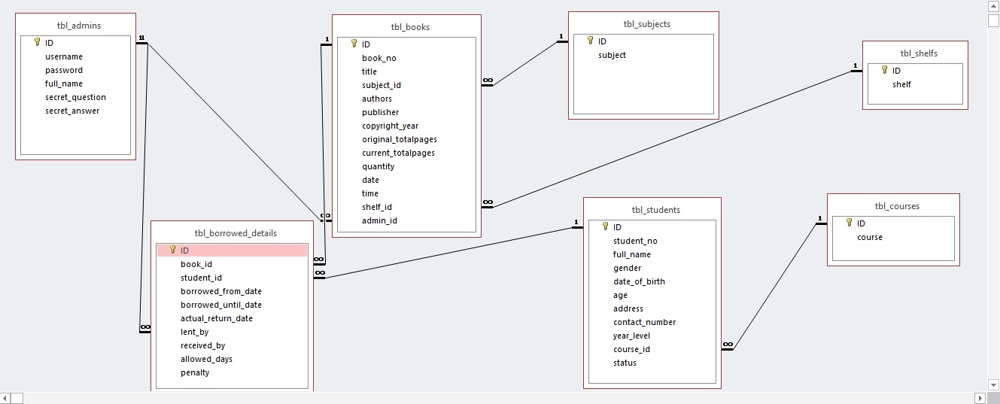

<h2> Accounts that already created </h2>  

-Username: JCM  
-Password: JCM  
-Full Name: Joshua C. Magoliman  
-Secret Question: What is your favorite color?  
-Secret Answer: JCM  

-Username: liezel01  
-Password: 123  
-Full Name: Liezel Guemo  
-Secret Question: What is your favorite color?  
-Secret Answer: 123  

-Username: charisa02  
-Password: 456  
-Full Name: Charisa Sevilla  
-Secret Question: What is love for you? 
-Secret Answer: 456  

-Username: karla03  
-Password: 789  
-Full Name: Karla Mae Plaza  
-Secret Question: What is your favorite song? 
-Secret Answer: 789  

